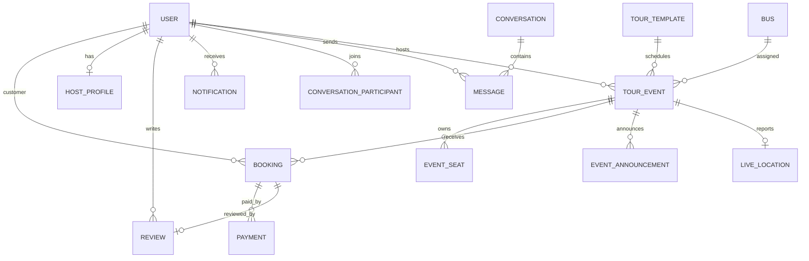

# Backend architecture and MongoDB model guide

## Architecture

The API foundation uses Node.js, Express, TypeScript, Zod, Mongoose, and MongoDB. It provides persistence models, reusable request validation, core booking/event services, health reporting, and development seed data. Phase 12 browser flows continue using their existing mock services. This phase does not provide business REST endpoints, Redis runtime integration, a Socket.IO server, payment processing, file uploads, Docker, CI, or deployment configuration.

```text
HTTP request
  -> Express security, CORS, parsing, request logging, rate limit
  -> /api and /api/v1 routes
  -> Zod request schemas
  -> domain services (pricing, seat claims, bus scheduling)
  -> repositories / Mongoose models
  -> MongoDB
  -> centralized JSON error response
```

`src/app.ts` creates an importable Express application. `src/server.ts` owns the HTTP listener, MongoDB retry loop, and graceful shutdown. `src/config/database.ts` owns one Mongoose connection. The listener stays available while MongoDB is disconnected, and `GET /api/health` reports that state. `src/constants`, `src/models`, `src/validators`, `src/repositories`, and `src/modules` contain shared vocabulary, persistence rules, request rules, persistence access, and business operations. `src/services/index.ts` is the public service entry point; routes/controllers can be added in later API work.

## Collections and relationships

| Collection | Relationships and guarantees |
| --- | --- |
| `User` | Unique normalized email; guest, host, admin, or super_admin role; hash-only password field excluded by default. |
| `HostProfile` | Optional host-only profile keyed uniquely by `userId`; holds assigned event IDs and host-specific details. |
| `TourTemplate` | Reusable tour text, itinerary, gallery references, pricing tiers, and configurable minimum advance percentage. |
| `TourEvent` | One dated run of a template; requires exactly one bus and host. Bus overlap checks and event creation run in a transaction. |
| `Bus` | Physical vehicle, A1–J4 and K1–K5 passenger layout, driver/helper/door metadata. Driver/helper seats and door are metadata, outside the 45 passenger seats. K3 marks the aisle obstruction. |
| `EventSeat` | Per-event seat state; unique `(eventId, seatNumber)`, status is not stored on the physical bus. |
| `Booking` | Customer/event/template references, guests, seat snapshot, price snapshot, advance rule, received/due amounts, booking and payment statuses. |
| `Payment` | Manual-ready record with cash/bank/mobile_banking/other method and pending/completed/failed/refunded status. No gateway is attached. |
| `Review` | User, event, booking, rating, images, and pending/approved/rejected moderation status. |
| `Notification` | User-scoped item with optional event/booking references, type, read flag, and query indexes. |
| `Conversation` / `Message` | Participant references and chronological messages; attachments are references only, no upload path. |
| `EventAnnouncement` | Event-scoped sender, title, and message for host/admin announcements. |
| `LiveLocation` | Exactly one latest point/status per event, with host and bus references; history is not stored here. |



Indexes follow read/write patterns: unique email, template slug, event code, booking code, payment transaction ID (when present), review per booking/customer, and event seat. Notification, conversation, and message indexes support user/event timelines. Indexes are declared in model code; apply/reconcile indexes in a controlled migration before production traffic.

## Event and seat rules

Each tour event references exactly one dedicated bus. Event creation checks for an overlapping active assignment and serializes concurrent schedules by writing the bus inside a MongoDB transaction. One event gets one event-seat document per passenger place. The same bus layout can be reused by non-overlapping events, each with independent seat availability. The passenger layout is exactly A-J × 4 (40 seats), then K1-K5 (5 seats). K3 is retained as a passenger seat and records `blocksAisle: true`; driver seat, helper seat, and door are separate vehicle metadata. A bus seat is never permanently marked booked.

## Booking and money rules

`quoteBooking` and `createBooking` read package prices and `minimumAdvancePercent` from the stored TourTemplate. `calculateBookingFinance` calculates subtotal, discount, total, minimum advance, received, and due values. The booking request has no authoritative price or received-amount field. Booking creation claims event seats and inserts the booking in one MongoDB transaction; a conflict aborts the transaction and leaves seat availability unchanged.

MongoDB is the source of truth for booking, payment, event, and seat state. Frontend values must never be used as financial authority. The minimum advance percentage is stored/configurable per tour template for admin configuration. Payments remain simple manual records in this phase; future confirmation/refund flows must update payment, booking, and seat state transactionally.

All future access-control middleware must scope guest queries to their own customer ID, hosts to assigned events, and admins to authorized business data. Current models/services are persistence foundations; no protected domain routes have been exposed yet.

## Validation, errors, and security

Zod validates environment configuration and incoming tour template, event, and booking payloads. Mongoose enforces stored fields, enums, relationships, and derived amount consistency. All errors use `{ success: false, error: { code, message, details? } }`; validation/cast failures return 400, duplicate keys and business conflicts return 409, and production errors do not return stack traces or database internals. Winston supplies structured production logs. Logs omit passwords and JWT secrets.

Helmet, configured-origin CORS, JSON/form request limits, cookie parsing, compression, Morgan request logs, and a global API rate limiter are installed. Copy `server/.env.example` to `server/.env` and provide MongoDB URI, CORS origin, and separate random JWT secrets of at least 32 characters. Do not commit `.env` files. `GET /api/health` and compatibility path `/api/v1/health` report API, MongoDB status, environment, and timestamp.

## Development seed and commands

Run `npm run seed --workspace=server` against a development MongoDB instance. The idempotent seed creates fake admin, host, and guest users, a host profile, sample tour template, bus, event, all 45 event seats, sample booking, and notification. Password hashes use a random secret that is never printed; fixture users are not login credentials. The seed refuses production and never drops collections.

Run `npm run test --workspace=server`, `npm run typecheck --workspace=server`, `npm run lint --workspace=server`, and `npm run build`. Model validation and HTTP health tests do not require MongoDB. Seed execution and transactional business services require a reachable MongoDB replica set (Atlas or a local replica set).

## Future realtime work

Phase 12 mock notification/messaging/location workflows remain unchanged. A future Socket.IO phase can publish committed MongoDB changes to authorized event participants. A future Redis phase can provide multi-instance fan-out or ephemeral coordination, but MongoDB transactions and unique event-seat indexes remain the authority for inventory. Do not use Redis locks in place of database seat claims. Live location updates should replace the one `LiveLocation` document per event while status is `active`; location is only shared while the host explicitly activates it. Long-term location history, if needed, belongs in a separately designed retention-optimized store.
